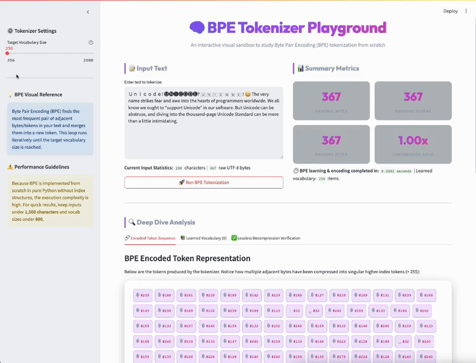

# Building GPT Tokenizer (Byte Pair Encoding) from Scratch

A comprehensive implementation of **Byte Pair Encoding (BPE)**, the tokenization algorithm used by GPT and modern Large Language Models (LLMs).

## Table of Contents

- [Overview](#overview)
- [Interactive Playground (Streamlit)](#interactive-playground-streamlit)
- [Why Tokenization?](#why-tokenization)
- [Understanding BPE](#understanding-bpe)
- [How It Works](#how-it-works)
- [Implementation](#implementation)
- [Usage](#usage)
- [Example](#example)
- [Key Concepts](#key-concepts)

## Overview

Tokenization is the process of converting raw text into discrete units (tokens) that an LLM can understand. This project implements **Byte Pair Encoding (BPE)**, the tokenization algorithm that powers GPT models.

### The Problem

- **Unicode Standard**: Contains ~150K characters across 161 scripts (including emojis)
- **LLM Limitation**: Models have a fixed vocabulary size (typically 50K-100K tokens)
- **Inefficiency**: Using raw Unicode code points wastes computational resources

### The Solution

BPE builds an efficient vocabulary by:
1. Starting with 256 possible byte values (UTF-8 bytes)
2. Iteratively merging the most frequent token pairs
3. Creating new tokens for common patterns
4. Reducing sequence length and improving efficiency

## Interactive Playground (Streamlit)

This repository includes a beautiful, interactive web interface built with **Streamlit** that allows you to play with the BPE tokenizer visually in real time.

### Features

- **Live Compression Metrics**: Input custom text of any length, set the target vocabulary size ($256$ to $2,000$), and view original bytes, encoded tokens, and decoded bytes.
- **Visual Token Chips**: View the resulting BPE tokens mapped colorfully. Every token chip shows the underlying text characters/bytes and its unique token ID. Long tokens break and wrap cleanly to keep the layout responsive.
- **Learned Vocabulary Explorer**: Look up the exact merged BPE rules table showing what token ID corresponds to which component pair and what character sequence it represents.
- **Lossless Verification**: Compare the original text and decoded text side-by-side with an auto-updating validation status showing that BPE decoding is 100% lossless.
- **Responsive Theme Support**: Designed with native Streamlit theme awareness and custom CSS media queries that adjust colors dynamically for both **Light Theme** and **Dark Theme** to ensure optimal contrast and readability.

### Run the App

1. Ensure you have `streamlit` installed:
   ```bash
   pip install streamlit pandas
   ```
2. Run the Streamlit server from the project directory:
   ```bash
   streamlit run app.py
   ```
3. Open the app in your browser at `http://localhost:8501`.

### Interface Demo


## Why Tokenization?

### Raw Unicode Approach ❌
```
Text: "안녕하세요 👋"
Length: 7 characters
Unicode bytes: ~20 bytes (inefficient)
```

### BPE Approach ✓
```
Text: "안녕하세요 👋"
Length: 7 characters
BPE tokens: 12 tokens (more efficient)
Reduced sequence length compared to raw UTF-8
```

## Understanding BPE

### Example: Building Vocabulary

Starting with the sequence: `"aaabdaaabac"`
Initial vocabulary: `{a, b, c, d}`

#### Step 1: Find most frequent pair
- Pairs: `aa` (3 times), `ab` (2 times), `bd` (1 time), `da` (1 time), `ac` (1 time)
- Most frequent: `aa`
- Create new token: `Z`
- Result: `"ZabdaZabac"`

#### Step 2: Find next most frequent pair
- Most frequent: `ab` (2 times)
- Create new token: `Y`
- Result: `"ZYdZYdac"`

#### Step 3: Continue merging
- Most frequent: `ZY` (2 times)
- Create new token: `X`
- Result: `"XdXdac"`

#### Final State
```
Sequence: "XdXdac"
Vocabulary: {a, b, c, d, Z, Y, X}
Compression achieved! ✓
```

## How It Works

### 1. UTF-8 Encoding
Any text is first converted to UTF-8 bytes:
```python
text = "Hello, Yellow"
bytes = text.encode('utf-8')  
# [72, 101, 108, 108, 111, 44, 32, 89, 101, 108, 108, 111, 119]
# H   e    l    l    o   ,   _   Y   e    l    l    o    w
```

### 2. Pair Frequency Analysis
Count how often each pair of tokens appears:
```python
tokens = [72, 101, 108, 108, 111, 44, 32, 89, 101, 108, 108, 111, 119]
pairs = {
    (72, 101): 1,   # "He"
    (101, 108): 2,  # "el" - appears TWICE (Hello + Yellow)
    (108, 108): 2,  # "ll" - appears TWICE (Hello + Yellow)
    (108, 111): 2,  # "lo" - appears TWICE (Hello + Yellow)
    (111, 119): 1,  # "ow"
    (44, 32): 1,    # ", "
    (89, 101): 1,   # "Ye"
    # ... more pairs
}
```

### 3. Merge Most Frequent Pair
Replace all occurrences of the most frequent pair with a new token. Multiple pairs tie at frequency 2, so we pick one (e.g., `(108, 108)` for "ll"):
```python
Most frequent pair: (108, 108)  # "ll" appears 2 times
New token: 256
Before: [72, 101, 108, 108, 111, 44, 32, 89, 101, 108, 108, 111, 119]
After:  [72, 101, 256, 111, 44, 32, 89, 101, 256, 111, 119]
```

### 4. Add this to original tokens: encoded map and decode map
```
encoded_map[(108, 108)] = 256
decoded_map[256] = (108, 108)
# helper map while decoding
```

### 5. Continue Merging
After the first merge, find the next most frequent pair and repeat:
```python
# Second iteration finds (101, 256) and (256, 111) as most frequent,
# lets replace (101, 256)
New token: 257
Before:  [72, 101, 256, 111, 44, 32, 89, 101, 256, 111, 119]
After: [72, 257, 111, 44, 32, 89, 257, 111, 119]

# Third iteration continues until target vocabulary size reached
# Final result: much shorter token sequence than original
```

### 6. Decoding
Reverse the process by looking up what each merged token represents:
```python
# Decode map (built during encoding)
decode_map[257] = (101, 256)
decode_map[256] = (108, 108)

# Recursive decomposition
tokens = [72, 257, 256, 111, ...]
  → 72 = 'H'
  → 257 = (101, 108) → 'e' + 'l'
  → 256 = (108, 108) → 'l' + 'l'
  → 111 = 'o'
Full result: [72, 101, 108, 108, 111, ...] → "Hello, Yellow"
```

## Implementation

### Class Structure

The implementation uses an object-oriented design with the `BytePairEncodingTokenizer` class:

#### Instance Variables (State)
```python
self.target_vocab_size      # Desired vocabulary size (default: 1000)
self.vocab                  # Set of token ids in vocabulary
self.current_vocab_size     # Current number of tokens
self.decode_map            # Maps token → (component1, component2) or token
self.encode_map            # Maps (component1, component2) → token
```

#### Core Methods

| Method | Purpose |
|--------|---------|
| `__init__(vocab_size)` | Initialize tokenizer with target vocabulary size |
| `encode(text)` | Convert text to BPE tokens |
| `decode(tokens)` | Convert tokens back to UTF-8 bytes |
| `decode_to_text(tokens)` | Convert tokens directly to text |

#### Private Helper Methods

| Method | Purpose |
|--------|---------|
| `_get_pairs(tokens)` | Find all adjacent token pairs and frequencies |
| `_merge_pairs(tokens, pair, new_token)` | Replace pair with new token |
| `_decompose_token(token)` | Recursively decompose token to base bytes |

## Usage

### Basic Example

```python
from Build_gpt2_tokenizer_from_scratch import BytePairEncodingTokenizer

# Initialize tokenizer with vocabulary size of 1000
tokenizer = BytePairEncodingTokenizer(vocab_size=1000)

# Encode text
text = "Hello, how are you?"
tokens = tokenizer.encode(text)
print(f"Tokens: {tokens}")
print(f"Token count: {len(tokens)}")

# Decode tokens back to text
decoded_text = tokenizer.decode_to_text(tokens)
print(f"Decoded: {decoded_text}")
assert decoded_text == text
```

### Unicode Support

```python
# Works with any Unicode text
text = "안녕하세요 👋 Hello"
tokens = tokenizer.encode(text)
decoded = tokenizer.decode_to_text(tokens)
assert decoded == text
```

### Custom Vocabulary Size

```python
# Larger vocabulary → fewer tokens but larger model
tokenizer_large = BytePairEncodingTokenizer(vocab_size=5000)

# Smaller vocabulary → more tokens but smaller model
tokenizer_small = BytePairEncodingTokenizer(vocab_size=256)  # No compression
```

## Example

### Complete Example from Code

```python
from Build_gpt2_tokenizer_from_scratch import BytePairEncodingTokenizer

test_text = "Unicode! The very name strikes fear and awe into the hearts of programmers worldwide."

tokenizer = BytePairEncodingTokenizer(vocab_size=1000)

# Encoding
encoded_tokens = tokenizer.encode(test_text)
print(f"Original length: {len(test_text)}")
print(f"Token length: {len(encoded_tokens)}")
print(f"Compression ratio: {len(test_text) / len(encoded_tokens):.2f}x")

# Decoding
decoded_text = tokenizer.decode_to_text(encoded_tokens)
assert decoded_text == test_text
print("✓ Lossless encoding/decoding verified")
```

### Output Example
```
Original length: 89
Token length: 45
Compression ratio: 1.98x
✓ Lossless encoding/decoding verified
```

## Key Concepts

### 1. **Vocabulary Size Trade-off**

| Vocabulary Size | Pros | Cons |
|-----------------|------|------|
| **Small (256)** | Minimal model size, no compression | Long token sequences, inefficient |
| **Medium (1K-10K)** | Good balance | Moderate model size |
| **Large (50K-100K)** | Short sequences, efficient | Large model, slow training |

### 2. **Token IDs**

- **0-255**: Original UTF-8 bytes
- **256+**: Merged token pairs (created during BPE training)

### 3. **Decode Map Structure**

```python
# Base tokens (unchanged)
decode_map[65] = 65  # 'A' maps to itself

# Merged tokens (pair references)
decode_map[256] = (72, 101)  # "He" 
decode_map[257] = (101, 108)  # "el"
```

### 4. **Lossless Encoding**

BPE is completely **reversible**:
- No information is lost during encoding
- Any encoded sequence can be perfectly decoded back to original text
- This is crucial for LLMs processing text

## Real-World Applications

### GPT Models
- **GPT-2**: Uses BPE with 50K vocabulary
- **GPT-3**: Uses BPE with 50K vocabulary  
- **GPT-4**: Enhanced BPE tokenizer

### Other Models
- **BERT**: Uses WordPiece (similar to BPE)
- **RoBERTa**: Uses BPE with 50K vocabulary
- **LLAMA**: Uses BPE with 32K vocabulary

## Performance Characteristics

### Time Complexity
- **Training**: O(n × vocab_size) where n = text length
- **Encoding**: O(m × log(m)) where m = token count
- **Decoding**: O(m × depth) where depth = recursion depth

### Space Complexity
- **Vocabulary maps**: O(vocab_size)
- **Decode map**: O(vocab_size)
- **Token list**: O(text_length)

## Further Reading

- [Byte Pair Encoding Paper](https://arxiv.org/abs/1508.07909)
- [OpenAI's Tokenizer](https://github.com/openai/tiktoken)
- [Unicode Standard](https://unicode.org/)

## Files

- `Build-gpt2-tokenizer-from-scratch.py` - Complete BPE tokenizer implementation
- `app.py` - Streamlit interactive web interface
- `README.md` - This documentation file

## Author

Built as an educational project to understand how modern LLMs tokenize text.

---

**Note**: This is an educational implementation. Production tokenizers like OpenAI's `tiktoken` include additional optimizations and features.
